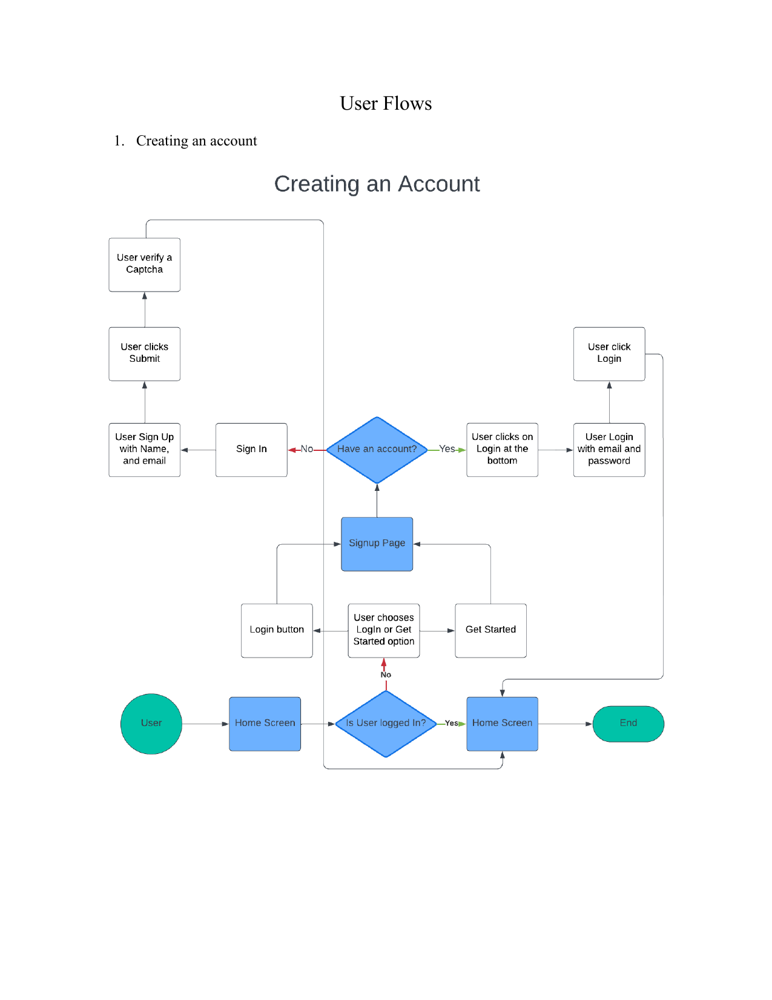
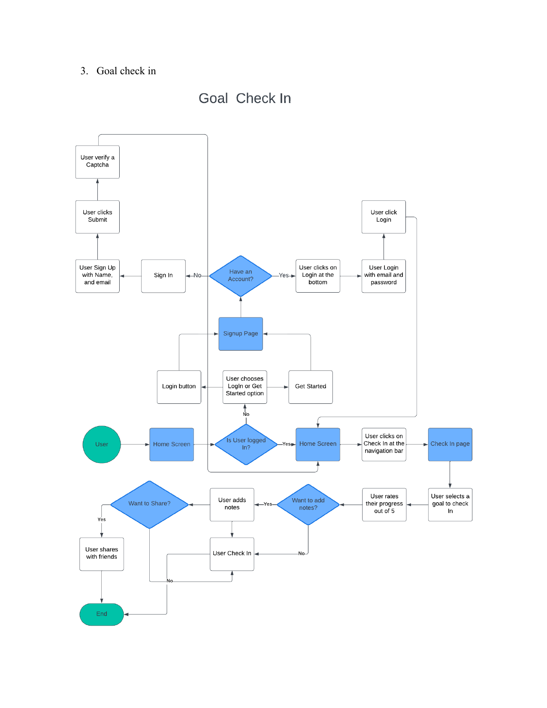
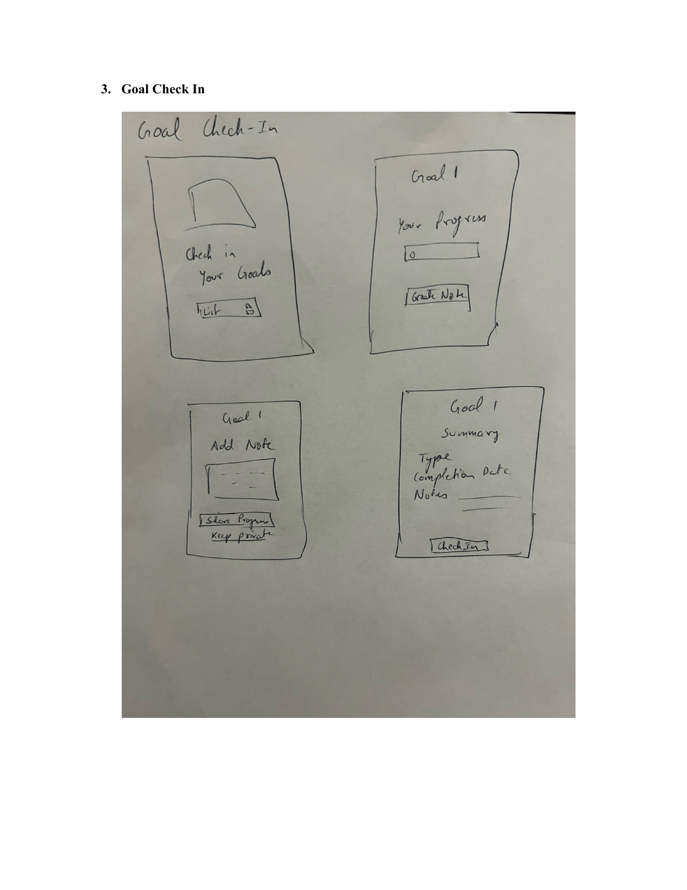
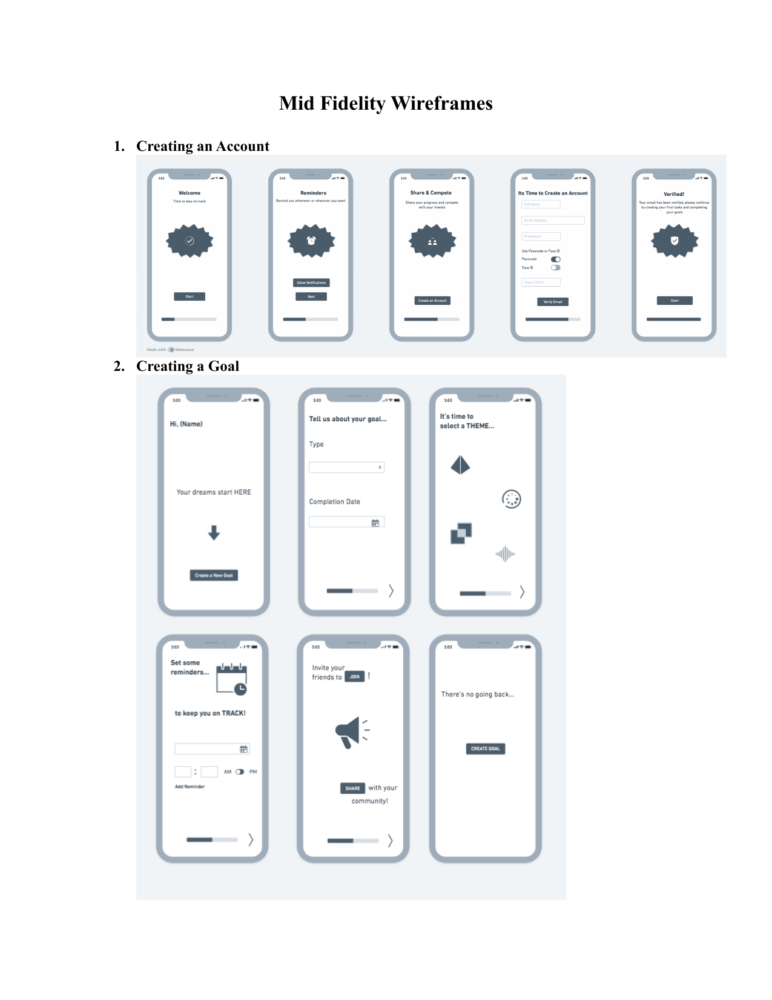
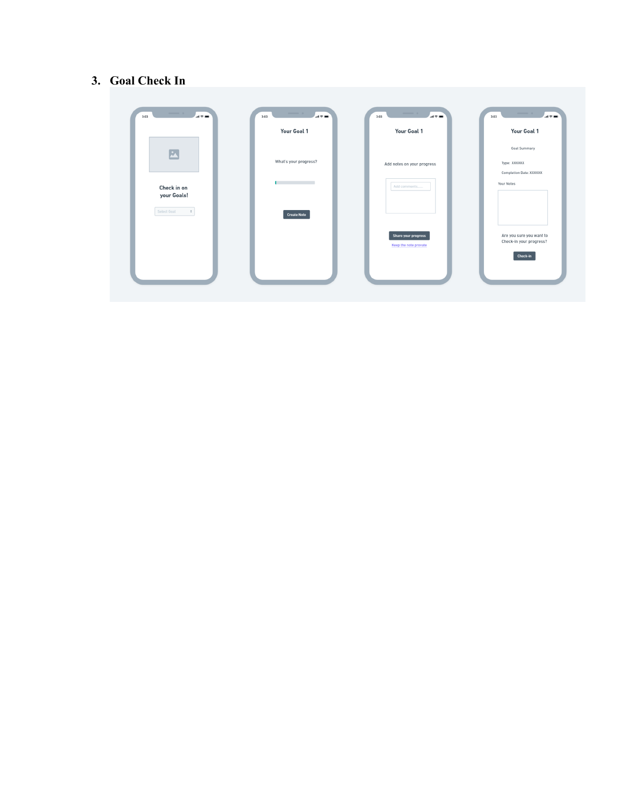
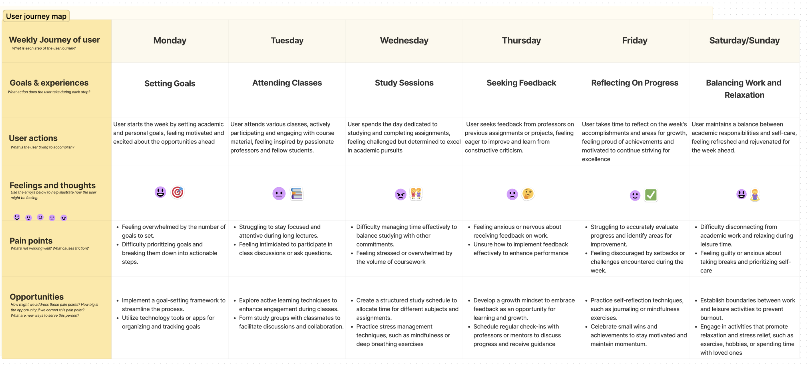

# 🏥 Apollo Urgent Care Kiosk

### An end‑to‑end UX case study for a self‑check‑in kiosk & web app, designed for **One‑in‑Gomillion (OiG)** — a non‑profit urgent care network serving low‑income communities across Texas.

<p>
  
  
  
</p>

**🔗 Live interactive prototype:**
[**Test the Apollo Urgent Care Kiosk on Figma →**](https://www.figma.com/proto/AV3LtHLNQDPD8AitsO3kFC/Apollo-Urgent-Care-Kiosk?node-id=1-2&starting-point-node-id=1%3A2&scaling=scale-down)

> No account or download needed — the link opens directly into Figma's interactive prototype viewer. Click through the flow as if you were a patient checking in at a kiosk.

---

## 📖 Table of Contents

- [Overview](#-overview)
- [Problem Statement](#-problem-statement)
- [Design Process](#-design-process)
  - [1. Research & Data Collection](#1-research--data-collection)
  - [2. Competitive Research & SWOT](#2-competitive-research--swot)
  - [3. Ideation](#3-ideation)
  - [4. Design System Research](#4-design-system-research)
  - [5. User Flows](#5-user-flows)
  - [6. Low‑Fidelity Wireframes](#6-low-fidelity-wireframes)
  - [7. Mid‑Fidelity Wireframes](#7-mid-fidelity-wireframes)
  - [8. Usability Testing Plan](#8-usability-testing-plan)
- [Screenshots](#-screenshots)
- [Repository Structure](#-repository-structure)
- [How to View the Prototype](#-how-to-view-the-prototype)
- [Tools Used](#-tools-used)
- [Key Takeaways](#-key-takeaways)
- [Author](#-author)

---

## 🩺 Overview

**Apollo Urgent Care Kiosk** is a UX design project that reimagines how patients check themselves in at an urgent care clinic. It was designed for **One‑in‑Gomillion (OiG)**, a non‑profit group of medical professionals building urgent care clinics across Texas to serve low‑income households.

Instead of a manual, paper‑based, front‑desk check‑in process, this project explores a **self‑service kiosk and web app** that lets patients scan a QR code on arrival, register or verify their details, select an appointment time, and get routed to the right provider — all with minimal friction and without needing prior technical experience.

This repository documents the **full design process**, from user research through low‑fidelity sketches, mid‑fidelity wireframes, a design system reference, and a usability testing plan — culminating in a working interactive prototype in Figma.

---

## 🎯 Problem Statement

**Original (raw) problem statement:**
> "As a nurse, I need patient records so we have patient records when we need them."

**Refined problem statement:**
> "As a nurse working at an OiG clinic, I face difficulties accessing patient records in a timely and efficient manner. This is hindering my ability to provide accurate and prompt healthcare services to our patients."

**How Might We:**
> How might we make it easier for medical professionals at OiG clinics to access and update patient records, ensuring efficient healthcare delivery — starting with a smoother, self‑guided check‑in experience for patients?

---

## 🔍 Design Process

This project follows a research‑driven UX process: **Discover → Define → Develop → Deliver.**

### 1. Research & Data Collection

To understand the needs of everyone who touches the medical records and check‑in process, I identified four core user roles and built a semi‑structured interview script around them:

| Role | Why they matter |
|---|---|
| 👨‍⚕️ **Doctors** | Primary care providers — need fast, accurate access to patient history |
| 👩‍⚕️ **Nurses** | First point of contact; bridge communication between patients and doctors |
| 🗂️ **Admin Staff** | Handle scheduling, coordination, and day‑to‑day clinic operations |
| 🛠️ **Technicians** | Keep the system running and maintained |

The interview script covered opening questions (comfort with technology, current workflow), core questions (pain points, integration needs, security concerns, scalability), and structured follow‑up/backup questions — with flexible in‑person and virtual scheduling to respect clinical staff availability.

### 2. Competitive Research & SWOT

A SWOT analysis was conducted to evaluate OiG's internal strengths/weaknesses and external opportunities/threats before designing a proprietary records and check‑in system:

- **Strengths:** Dedicated medical staff, growing Texas‑wide clinic footprint, non‑profit backing from donors
- **Weaknesses:** Limited budget for equipment, minimal staff tech training, fragmented inter‑department communication
- **Opportunities:** Internship/talent pipelines, telehealth expansion, partnerships for affordable prescriptions
- **Threats:** Healthcare policy/reimbursement changes, new low‑cost competitors, cybersecurity/data‑breach risk

A **Competitive Analysis** of other clinics' records and check‑in systems was also used to identify patterns worth reusing and mistakes worth avoiding — while **Lightning Demos** were considered less directly applicable given OiG's need for a fully proprietary system.

### 3. Ideation

Working from the accountability/engagement angle of the problem, I ran a structured brainstorm with peers and family, then synthesized the results:

**Brainstorming themes that emerged:**
- 🧑‍🤝‍🧑 **Support System** — mentors/advisors keeping users on track
- 📱 **Tools & Applications** — apps to track progress automatically
- 👀 **Visual Aids** — visible, always‑present goal/progress indicators
- 📓 **Self‑Reflection** — journaling and personal progress logs
- 🤝 **Collaborative Accountability** — peer‑driven motivation

**SCAMPER technique** was then applied to push these themes into concrete product ideas — e.g., *substituting* paper planners with app‑based reminders (Todoist, Google Calendar style scheduling), and *combining* habit‑tracking with milestone check‑ins — directly informing the goal‑setting and check‑in interactions later carried into the wireframes.

### 4. Design System Research

Before designing screens, I researched an established design system to ground UI decisions in proven patterns: **[Microsoft Fluent Design System](https://fluent2.microsoft.design/get-started/whatisnew)**.

Key elements studied: design language & principles, color, elevation, iconography, layout, material, motion, shape, and typography — plus system‑level guidelines for accessibility, content design, design tokens, and platform‑specific conventions.

**What I borrowed from it:** Fluent's documentation practice of pairing concise text with clear visuals, consistent use of headings/bullets/whitespace, and easy in‑document navigation — principles applied throughout this project's own documentation (including this README).

### 5. User Flows

Full end‑to‑end user flows were mapped for the three core journeys: creating an account, setting up a goal/check‑in item, and completing a check‑in — including edge cases like login state, CAPTCHA verification, and returning users.

- **Creating an Account** — sign‑up vs. login branch, CAPTCHA verification, routing to home
- **Creating a Goal** — entering details, selecting completion date, setting reminders
- **Goal Check‑In** — selecting an item, rating progress, optional notes, optional sharing

### 6. Low‑Fidelity Wireframes

Hand‑sketched wireframes were used early to rapidly test layout and flow before investing in visual design:

1. **Creating an Account** — Welcome → account details/passcode/Face ID → email verification → confirmation
2. **Creating a Goal** — intro screen → goal type & completion date → theme selection → reminders
3. **Goal Check‑In** — check‑in list → progress input → add note (share or keep private) → summary confirmation

### 7. Mid‑Fidelity Wireframes

The low‑fidelity sketches were translated into cleaner, structured mid‑fidelity screens with consistent components, progress indicators, and clearer visual hierarchy — refining the same three flows (account creation, goal creation, check‑in) ahead of prototyping in Figma.

### 8. Usability Testing Plan

A full **unmoderated usability testing plan** was written to validate the self‑check‑in experience before finalizing the build:

- **Scope:** QR code scanning, registration & personal detail entry, personalized time selection, appointment scheduling/doctor assignment, and overall navigation/information architecture
- **Audience:** ~10 participants, ages 15–75+, mixed gender, mixed occupations (students, working professionals, retirees), and mixed technical proficiency — chosen deliberately to reflect the real diversity of an urgent care waiting room
- **Format:** Unmoderated testing, conducted both in‑person and via video call, to gather natural, unbiased feedback
- **Metrics tracked:** Task Success Rate, Time to Completion, Error Rate, and Satisfaction Scale
- **Open questions investigated:** QR scan intuitiveness across tech‑proficiency levels, friction in medical‑info entry, privacy/security concerns, accuracy of doctor assignment, and perceived accuracy of estimated appointment times

---

## 🖼️ Screenshots

> Place the exported images (included alongside this README) into an `assets/screenshots/` folder at the root of your repo, then these will render automatically on GitHub.

### User Flows
| Creating an Account | Creating a Goal | Goal Check‑In |
|---|---|---|
|  |  |  |

### Low‑Fidelity Wireframes
| Account & Goal Creation | Goal Check‑In |
|---|---|
|  |  |

### Mid‑Fidelity Wireframes
| Account Creation | Goal Creation & Check‑In |
|---|---|
|  |  |

### User Journey Map


---

## 📁 Repository Structure

A suggested structure for organizing these files in your GitHub repo:

```
apollo-urgent-care-kiosk/
├── README.md
├── assets/
│   └── screenshots/
│       ├── user-flow-creating-account.png
│       ├── user-flow-creating-goal.png
│       ├── user-flow-goal-checkin.png
│       ├── low-fi-account-goal-creation.png
│       ├── low-fi-goal-checkin.png
│       ├── mid-fi-account-creation.png
│       ├── mid-fi-goal-creation-checkin.png
│       └── user-journey-map.png
├── docs/
│   ├── A1-Data-Collection.pdf
│   ├── A2-Competitive-Research.docx
│   ├── A3-Ideation.docx
│   ├── A6-Design-System.pdf
│   ├── User-Flows.pdf
│   ├── Low-Fidelity-Wireframes.pdf
│   ├── Mid-Fidelity-Wireframes.pdf
│   └── Testing-Plan-Report.pdf
```

---

## 🧪 How to View the Prototype

1. Click the **[Figma prototype link](https://www.figma.com/proto/AV3LtHLNQDPD8AitsO3kFC/Apollo-Urgent-Care-Kiosk?node-id=1-2&starting-point-node-id=1%3A2&scaling=scale-down)** above.
2. The prototype opens directly in **presentation/play mode** — no Figma account required.
3. Click through the flow starting from the welcome/home screen: account creation → goal/appointment setup → check‑in.
4. Use the on‑screen arrows or hotspots to navigate between screens, just as a patient would on the kiosk.

---

## 🛠️ Tools Used

- **Figma** — mid‑fidelity wireframing & interactive prototyping
- **Paper sketching** — low‑fidelity wireframes
- **Whimsical** — user journey mapping
- **Draw.io / flowchart tooling** — user flow diagrams
- **Microsoft Fluent Design System** — design system reference & inspiration

---

## 💡 Key Takeaways

- Designing for a **diverse, mixed‑proficiency user base** (ages 15–75+, varying tech comfort) meant prioritizing simplicity, large touch targets, and minimal required input at every step.
- Early **low‑fidelity sketches** made it fast and cheap to test the account‑creation and check‑in flow before committing to visual design.
- Grounding UI decisions in an established **design system (Fluent)** helped keep the mid‑fidelity screens consistent and accessible from the start.
- Planning **unmoderated, mixed remote/in‑person usability testing** ensured feedback would reflect how real patients — not just designers — experience the kiosk.

---

## 👤 Author

**Pratyush Saxena**

Feel free to explore the [prototype](https://www.figma.com/proto/AV3LtHLNQDPD8AitsO3kFC/Apollo-Urgent-Care-Kiosk?node-id=1-2&starting-point-node-id=1%3A2&scaling=scale-down) and reach out with any feedback or questions.
